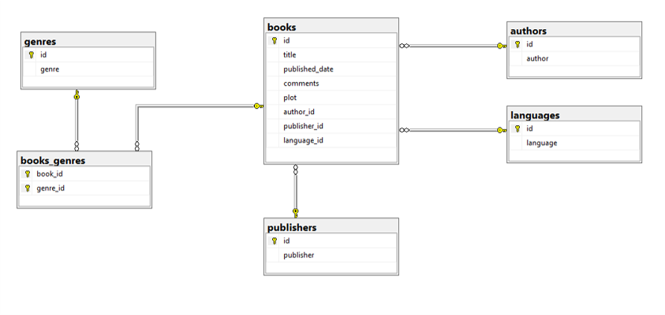

# Hasan Can Kose -- Odev 2

## 1. Database Design

## 2. Dapper Crud Example

Bu proje, dapper-crud-example klasöründe oluşturulmuştur.

## 3. Middleware
* POST request atıldığında yasaklı kelimelerin kullanılması engellenebilir.
* Request'in hangi IP adresi üzerinden geldiği kontrol edilebilir ve yasaklı IP adresleri engellenebilir.
* Request limiter yapılabilir. Aynı IP üzerinden belirlenen süre içerisinde belirlenen sayıda request'in gelmesi engellenebilir.
